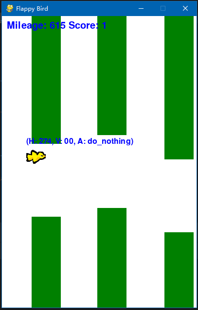

# The Game - Flappy Bird

Flappy Bird is a simple game to study how to build a reinforcement learning agent given its limited action 
space (i.e., jump or do nothing) and simple game logic (i.e., game over when the bird hits a pipe or drops out of the screen). 
The goal is to control the bird so that it dodges as many pipes as possible. 
Here we present you a simple Flappy Bird environment (emulator) made by [Pygame](https://www.pygame.org/news) and [Gymnasium](https://gymnasium.farama.org/index.html) (formerly OpenAI's Gym). 
The initial code of the game environment was composed by ChatGPT, if you are interested, you may ask ChatGPT: "Can 
you make a Flappy Bird game?", you will get something similar. A screenshot of the game graphics is below.

The game is playable, and we encourage you to play the game yourself before designing your agent. 
You may adjust the pipe, text, and background colors to make it conformable to your eyes. 
You may also swap the bird image as you see fit.
Also, note the game can be run with or without showing the game window, please check the `show_screen` option 
in the game emulator. 

**You should start looking into the assignment as soon as possible. 
It is a 30% mark assignment, and it is unlikely that you can complete this assignment with full 
marks spending less than two days of effort.**

We break down the assignment description into the following sections:

1. [Installation and playing the game](documentation/INSTALLATION.md)
2. [Assignment description](documentation/ASSIGNMENT_DESCRIPTION.md)
3. [Game information](documentation/GAME_INFORMATION.MD)
4. [Assessment description](documentation/ASSESSMENT_DESCRIPTION.md)
5. [Helpful advice](documentation/HELPFUL_ADVICE.md)

