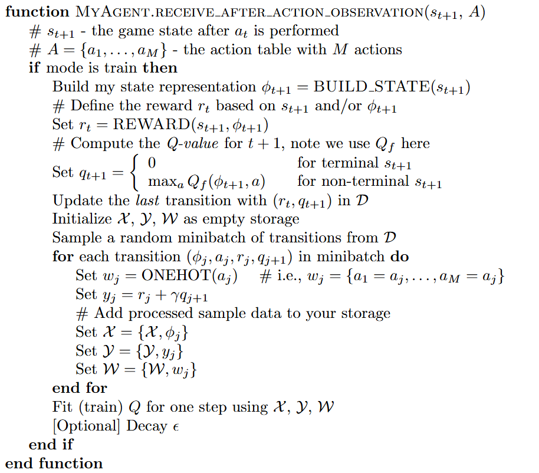

# Assignment Description

## Assignment objective

The assignment objective is for you to design an agent that can play the Flappy Bird game by itself.
An agent class template has been created for you: [my_agent.py](../my_agent.py).
The game's increasing levels of difficulty are designed to gently guide you to master the craft of reinforcement learning.

## Deep Q-learning Network (DQN) algorithm 

In this assignment, we'd like you to implement the [Deep Q-learning algorithm](https://arxiv.org/pdf/1312.5602) to train your agent.
The original DQN algorithm is `Algorithm 1` in the above link.
It is a cool algorthm, if you are interested in what it is capable of, check this video [Google DeepMind's Deep Q-learning playing Atari Breakout!](https://www.youtube.com/watch?v=V1eYniJ0Rnk).
Implementing the full algorithm can be a bit difficult, therefore, we modified Algorithm 1 to `Algorithm 2` below to reduce computational requirements and overall difficulty.
If you are interested in what we modified, please check the content in the [Helpful advice](HELPFUL_ADVICE.md) page.
Reading the linked paper and lecture notes can help you understand the reinforcement learning concepts better.
Another useful online resource to understand DQN is from [HuggingFace](https://huggingface.co/learn/deep-rl-course/unit3/deep-q-algorithm).


The blue colored lines are already implemented by us so your task is mainly implementing functions in the `MyAgent` class  
located in [my_agent.py](../my_agent.py). To quickly go through Algorithm 2, the main for-loop is defined below.
You will see this section of code at the end of `my_agent.py` as well. As you may have noticed, Algorithm 2 is the
agent training algorithm.

```python
# bare-bone code to train your agent (you may extend this part as well, we won't run your agent training code)
env = FlappyBirdEnv(config_file_path='config.yml', show_screen=True, level=args.level, game_length=10)
agent = MyAgent(show_screen=True)
episodes = 10000
for episode in range(episodes):
    env.play(player=agent)

    # env.score has the score value from the last play
    # env.mileage has the mileage value from the last play
    print(env.score)
    print(env.mileage)

    # store the best model based on your judgement
    agent.save_model(path='my_model.ckpt')

    # you'd want to clear the memory after one or a few episodes
    ...

    # you'd want to update the fixed Q-target network (Q_f) with Q's model parameter after one or a few episodes
    ...
```
The `env.play(...)` is a function of the emulator which handles the inner while-loop in Algorithm 2, please see [console.py](../console.py).
You don't need to change any code in `console.py`, and we won't use your submitted `console.py` even if you upload it.

```python
def play(self, player=None):
  # code omitted for clarity
  ...
  while not self.done:  # the game is not finished yet.
    # let the player choose an action based on the current state
    current_state = self.get_state()
    action = player.choose_action(state=current_state, action_table=self.action_table)

    # execute action in the environment (emulator), code omitted for clarity
    ...

    # let the player know about the state after the action is performed
    state_after_action = self.get_state()
    player.after_action_observation(state_after_action)
```

## Your task

Please implement the `choose_action(...)` and `after_action_observation(...)` functions
in [my_agent.py](../my_agent.py) to complete the modified DQN algorithm.
The pseudocode of each is provided below.




In order to train your agent properly, you should also take care of the following bits.
1. Use your creativity and analytical skills to design the functions `BUILD_STATE()` and `REWARD()`. They are critical
to your agent learning. We give you some advice over this at the beginning of the [Helpful advice](HELPFUL_ADVICE.md) page.
2. Implementing the `ONEHOT()` function properly. Incorrect implementation of the function will directly affect the learning of the MLP.
3. The `MyAgent.__init__(...)` function is partially implemented for you. You should define the instance 
variables/attributes specified in the pseudocode of `__init__(...)` below.
4. You may add additional variables and helper functions as you need, but make sure they are written in the file my_agent.py.
5. You may want to clear the agent's memory D periodically, this is because we directly compute q<sub>t+1</sub> before storing them in D. Those historical q values may become obsolete quickly as the network updates. 
6. We assume some of you do not know how to train a deep learning neural network, if so you can use the MLP network defined in [pytorch_mlp.py](../pytorch_mlp.py) to implement the Q-value network.
The MLP network is an imitation of [MLPRegressor](https://scikit-learn.org/stable/modules/generated/sklearn.neural_network.MLPRegressor.html)
from `scikit-learn`. As `MLPRegressor` does not allow multiple regression outputs, we provide our own implementation
to you to reduce the overall difficulty of the assignment. The `MLPRegression` has an example usage written at the end of the file.
If you want to edit the MLP model, please feel free to do so, but please make sure the model file is not too large.
The default network structure `(200, 500, 100)` is sufficiently large to handle the Flappy bird game and the saved model size
is <1 MB.


## Portals:
1. [Main page](../README.md)
2. [Installation and playing the game](INSTALLATION.md)
3. Assignment description <- you are here
4. [Game information](GAME_INFORMATION.MD)
5. [Assessment description](ASSESSMENT_DESCRIPTION.md)
6. [Helpful advice](HELPFUL_ADVICE.md)
