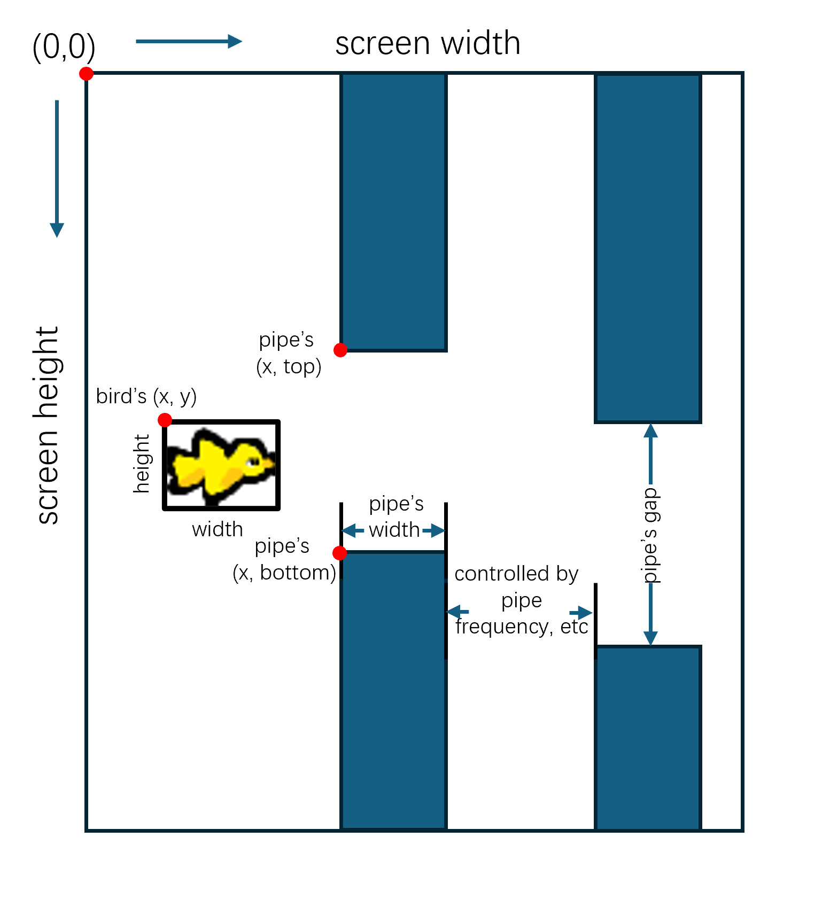

# Game information

## Game state information (s<sub>t</sub> or s<sub>t+1</sub>)

The game emulator communicates to your agent by sending a `state` dictionary.
The information is assembled in the `get_state(...)` 
function located in [console.py](../console.py). Here, we list the `state` enclosed information.
```python
state = {'bird_x': int, # bird's x of the top left corner, see picture below
         'bird_y': int, # bird's y of the top left corner, see picture below
         'bird_width': int, # bird's width, see picture below
         'bird_height': int, # bird's height, see picture below
         'bird_velocity': int, # bird's velocity
         'pipes': [ 
            {"x": int, # pipes' x as the x on the its left hand side, see picture below
             "top": int, # top pipe's y of the bottom left corner, see picture below
             "bottom": int, # bottom pipe's y of the top left corner, see picture below
             "width": int, # the pipes' width, see picture below
            }, # each pipe has its own dictionary structure. 
            ...
         ], # note 'pipes' is a list of pipe dictionary. It could have from 0 to many pipes.
         'pipe_attributes': {
            "pipe_frequency": int, # the pipe appearing frequency. The frame rate, pipe speed, and pipe frequency jointly control how fast the pipes move.
            "width": int, # each pipe's width, redundant to the width in `pipes`
            "window_y_mean": int, # the mean of the uniform distribution which samples the pipe window's y
            "window_y_offset": int, # the offset of the uniform distribution which samples the pipe window's y,
            "gap": int, # gap between two pipes **vertically**
            "formation": str, # formation in ['random', 'sine'], which specifies how the pipes are initialised.
         }, # pipe attributes are here mostly for your information. You most likely do not need them.
         'screen_width': int, # see picture below
         'screen_height': int, # see picture below
         'score': int, # the amount of pipes that have been dodged.
         'mileage': int, # the amount of pixels that went past the bird, i.e., you may notice the bird never moves on the x-axis
         'done': bool, # is the game over? True = yes 
         'done_type': str # done_type in ['not_done', 'off_screen', 'hit_pipe, 'well_done']
                          # not_done:  the game is not finished
                          # off_screen: the bird went over the y-axis limits
                          # hit_pipe: the bird's bounding box overlaps with a pipe's bounding box, resulting in a collision
                          # well_done: the game finishes due to the limit of the maximum scores being reached.
 }
```
Here we show a figure that visualises some of the above quantities:



## Action table (A)

The eligible actions are defined in [config.yml](../config.yml). The action table is supplied to the agent
when the agent's `choose_action(...)` and `after_action_observation(...)` functions are invoked.
```yml
action_table:
  jump: 0 # make the birdie jump
  do_nothing: 1 # literally do nothing (let the gravity do the work!)
  quit_game: 2 # this allows the agent to close the game window, useful for the human agent, AI agent should ignore this.
```

## Portals:
1. [Main page](../README.md)
2. [Installation and playing the game](INSTALLATION.md)
3. [Assignment description](ASSIGNMENT_DESCRIPTION.md)
4. Game information <- you are here
5. [Assessment description](ASSESSMENT_DESCRIPTION.md)
6. [Helpful advice](HELPFUL_ADVICE.md)