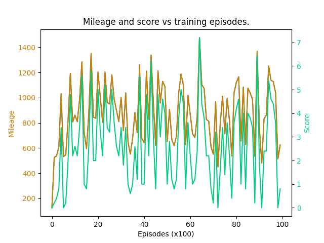

## Helpful advice

**Correctly implementing the algorithm does not necessarily make your agent pass the difficult levels.**
The success of the agent learning is closely tied to the state representation in `BUILD_STATE()` and reward definition in `REWARD()`.
Here are a few points to help you investigate the problem.
1. How should I present the information to the agent. What information is critical to the survival of the bird and how can I express it?
2. The values contained in the `state` are in pixel measurement, do I need to normalise them? (You may ask ChatGPT why normalisation is important)
3. As a human being, how would I 'place' the bird to make it safer?
4. Are game-overs by hit-the-pipe and went-off-the-screen considered equally bad to the agent? If not, which one is more preferred?
5. Similarity, are game-overs by hitting different sections of a pipe considered equally bad? If not, hitting what section demonstrates a better intelligence of the agent?
6. Carefully consider the utility  of the discounting factor (γ), what does it do and how does it affect your balance between the intermediate vs long term rewards?
7. Also in the algorithm we ask you to store 4 values in D, it does not hurt to store additional information, e.g.:
   1. Is the action taken random or not?
   2. What is the current step t's Q-value?
   3. How can you use those information to identify potential errors in your code? Especially when you cannot pass lv1.
8. To what extent is random action (exploration) helpful to the bird's survival? 
   1. If yes, what is a good ε value to start? Do I need to dial down the ε and how fast should I do it? What would be a good final ε value?
   2. If not, what ε value should I set?
   3. The algorithm here is called ε-greedy (check ChatGPT and/or Wiki)
9. What learning rate should I use to train the MLP model? To reduce the agony of hyperparameter tuning, you may try 1e-3 and go down by a scale of 1/10 until it stabilises your training. Most likely (depending on your implementation and input feature normalisation of course) you won't need a large learning rate above 1e-3.
10. You may consider printing out the Q values as a way to debug.
11. You may consider generating a figure that plots the average mileage/score vs the number of training episodes. The trend is likely to show you whether your agent is learning something. We won't evaluate your figure. This is for your own understanding. An example figure is given in the section below.
12. **The `show_screen=False` mode in `FlappyBirdEnv` (and overrideable in `MyAgent`) can let you train the agent faster with the window rendering turned off.**
13. The `verbose` option in `FlappyBirdEnv` can turn on/off the bird's y, velocity, and the last action taken displayed above the bird.
14. The game window may freeze and occasionally hang up your IDE. You can kill the Python process in your task manager to resolve that. 

## Example mileage and score plot

The below shows a training journey with 10,000 episodes on level 6. The shown mileages and scores are averaged over 5 runs using the `eval` mode.
This image shows you that the training of the agent may or may not necessarily achieve better performance with a prolonged number of episodes in this assignment.
You should consider saving the best model according to the best average score.

## Breakpoint debugging helps

Integrated Development Environments (IDEs, such as VS Code and PyCharm) are capable of letting you debug your Python code by putting a breakpoint at a 
line of code. You can run your code to that line and see what values are contained in each variable. If you haven't tried 
such feature, please consider spending time to learn it, otherwise you are unlikely to detect bugs (if any) in your code and waste a lot of time as a result.

## Modification to the DQN algorithm

1. We simplified the algorithm to pre-compute qt+1 before storing it in D, instead of computing it based on ϕj+1 each time a minibatch of transition is sampled.
2. We use two instances of the Q network, one runs to predict and to updates (Q) and one runs to provide stable Q-value targets to stabilise the training (Qf). You need to update Qf's parameters periodically with Q's parameters. Combining 1. and 2. can save computation, but the Q values stored in D can obsolete, and you may need to periodically clear D and update Qf.
3. We hardcode the Adam optimizer for the MLP with an initial learning rate. Adam automatically scales the gradient which makes it less of a hassle to train the MLP. However, this can cause a slow convergence of the network.
4. The ε exploration can jeopardize the training. The flappy bird game is a delicate game that a slight mistake would end the game. 

The modifications aim at reducing the knowledge you need to solve the assignment as well as reducing the computation requirement (i.e., can run faster).
If you want to try the original DQN algorithm or other reinforcement learning algorithms, please feel free to do so but perhaps after you pass all the Gradescope test cases. 
If you choose to implement the other methods but fail to pass the test cases, we won't take it as a valid reason for extension or offer you partial marks.

## Miscellaneous items

1. The bird image can be customised, please refer to [config.yml](../config.yml).
2. The config file we give you is the same config file we will use to evaluate your code. There are no hidden rules!
3. If you choose to customise the MLP model and/or run the model training on GPU, please make sure the model is not saved in Cuda tensor type. We will only run your model in CPU mode.
4. In general, if your agent passes lv6, the same model should also do well the previous levels but not necessarily (why?).

## Portals:
1. [Main page](../README.md)
2. [Installation and playing the game](INSTALLATION.md)
3. [Assignment description](ASSIGNMENT_DESCRIPTION.md)
4. [Game information](GAME_INFORMATION.MD)
5. [Assessment description](ASSESSMENT_DESCRIPTION.md)
6. Helpful advice <- you are here